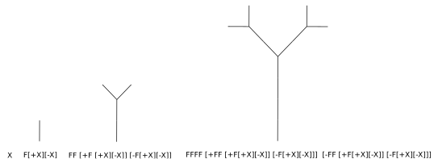

# 3D L-System Playground

Build simple deterministic and context-free L-Systems in 3D:


Check demo [here](https://sleepy-bastion-18703.herokuapp.com/).

- [L-Systems](#lsystem) 
- [This Project](#this-project)
- [Installation](#installation)

## L-Systems <a name="lsystem"></a>

Despite the fact that many plants have rather convoluted structures, development of theses structures over time can be described by conveniently simple rules. Mathematical framework that captures these rules was developed in 1968 by Astrid Lindenmayer and is known as the **L-System**.

It is convenient to think of the L-System in the context of **language and grammar**. If language is a set of character strings and grammar is a set of rules that specify how these characters need to be rewritten, then the L-System is just a type of string rewriting mechanism. For example, suppose the alphabet of our language consists of two characters `a` and `b`, and the grammar rules say that whenever we encounter `a` we should rewrite it as `ab` and whenever we encounter `b` we should rewrite it as `a`. If we initially start with `a`, then over time our system will change as:
```
a -> ab -> aba -> abaab -> abaababa -> ...
```

Of course, if L-Systems would be only about manipulating strings, they would be a bit boring. What makes them exciting (and useful for describing plant structures) is their geometrical interpretation! A simple string of characters can be interpreted as a list of commands given to a [**turtle**](https://en.wikipedia.org/wiki/Turtle_graphics), which can move around a 2D canvas and optionally leave a trail behind. 

Suppose we have a different system now. Its initial state (called **axiom**) is `X`, and the rules say that whenever we encounter `X` we rewrite it as `F[+X][-X]`, whenever we encounter `F` we rewrite it as `FF`, and all other symbols remain the same. We can formalize it as:
```
Axiom: X
Rules:
    X -> F[+X][-X]
    F -> FF
```

Our turtle should interpret the symbols as following:
- `X` - do nothing
- `F` - move forward some distance ***d*** and leave the trail
- `+` - turn counterclockwise by some angle &delta;
- `-` - turn cclckwise by some angle &delta;
- `[` - take a record of the current position (x,y coordinates) and orientation (combined angle)
- `]` - go back to the last recorded position and orientation, don't leave the trail

If we let the turtle wander around for a few steps, this is what we'll get:



It looks a bit edgy and simplistic, but there's definitely something plant-like about it. If we choose more sophisticated rules and adjust distance ***d*** and angle &delta; we can make it look more aesthetic/plant-like. Other ways to improve the astetics/realism to use probabilistic rules, make growth depend on the context and switch to 3D.

## This Project <a name="this-project"></a>
In this project we have a simple deterministic (there's only one rule for each symbol) and context-free (no special rules are applied if the symbol is neighboured by some other symbols) system rendered in 3D. 

3D means that we have extra degrees of freedom, and instead of simple "turn clockwise/anticlockwise" we can:
- **yaw** - bend left/right
- **pitch** - lean forward/backward
- **roll** - turn clockwise/anticlockwise


Aside from that, `F` is rendered as a branch or a part of the stem, and additional symbol `L` is rendred as a leaf. 

Here's the list of all the allowed symbols and their turtle commands:
- <code>X</code>: do nothing (seed)
- <code>F</code>: draw a branch/part of the stem and move forward the length of the branch
- <code>L</code>: draw a leaf and move forward the length of the leaf (better always keep it in square brackets)
- <code>[</code>: make a record of the current position and orientation
- <code>]</code>: assume the last recorded position and orientation
- <code>+</code>: yaw to the left
- <code>-</code>: yaw to the right
- <code>^</code>: pitch forward
- <code>v</code>: pitch backward
- <code>d</code>: roll counterclockwise
- <code>b</code>: roll clockwise

## Installation <a name="installation"></a>
No need to install, just use this [demo](https://sleepy-bastion-18703.herokuapp.com/).

If you want to tinker with the code, follow the instructions below:

Make sure you have [node.js](https://nodejs.org/en/) v10.0.0 or higher.

Clone this repo to your machine:
``` bash
$ git clone https://github.com/axyorah/lsystem3d.git
```

Install the dependencies: go to the project's root directory and run:
``` bash
$ npm install 
```

Install [`http-server`](https://www.npmjs.com/package/http-server):
```bash
$ npm install --global http-server
```

Start the http server: in the project's root directory run:
```bash
$ http-server . -p 8181
```

In your browser go to `localhost:8181` and have fun!